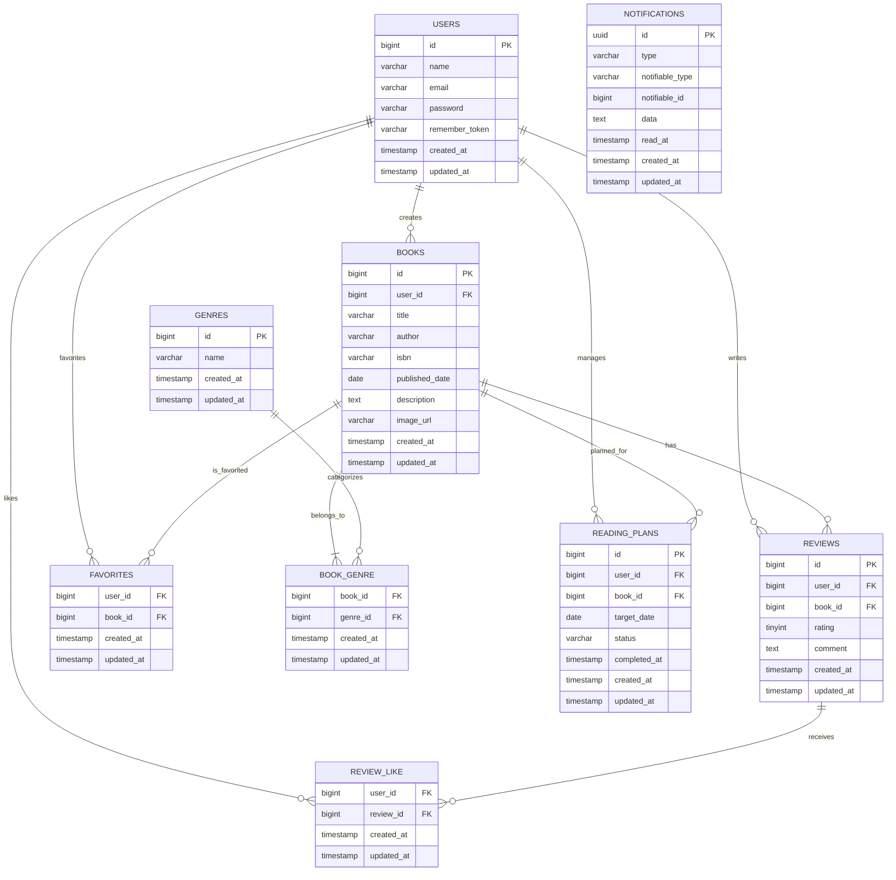

# BookShelf 応用ER図

```mermaid
erDiagram

    USERS {
        bigint id PK
        varchar name
        varchar email
        varchar password
        varchar remember_token
        timestamp created_at
        timestamp updated_at
    }

    BOOKS {
        bigint id PK
        bigint user_id FK
        varchar title
        varchar author
        varchar isbn
        date published_date
        text description
        varchar image_url
        timestamp created_at
        timestamp updated_at
    }

    REVIEWS {
        bigint id PK
        bigint user_id FK
        bigint book_id FK
        tinyint rating
        text comment
        timestamp created_at
        timestamp updated_at
    }

    GENRES {
        bigint id PK
        varchar name
        timestamp created_at
        timestamp updated_at
    }

    FAVORITES {
        bigint user_id FK
        bigint book_id FK
        timestamp created_at
        timestamp updated_at
    }

    REVIEW_LIKE {
        bigint user_id FK
        bigint review_id FK
        timestamp created_at
        timestamp updated_at
    }

    BOOK_GENRE {
        bigint book_id FK
        bigint genre_id FK
        timestamp created_at
        timestamp updated_at
    }

    READING_PLANS {
        bigint id PK
        bigint user_id FK
        bigint book_id FK
        date target_date
        varchar status
        timestamp completed_at
        timestamp created_at
        timestamp updated_at
    }

    NOTIFICATIONS {
        uuid id PK
        varchar type
        varchar notifiable_type
        bigint notifiable_id
        text data
        timestamp read_at
        timestamp created_at
        timestamp updated_at
    }

    USERS ||--o{ BOOKS : creates
    USERS ||--o{ REVIEWS : writes

    BOOKS ||--o{ REVIEWS : has

    BOOKS ||--|{ BOOK_GENRE : belongs_to
    GENRES ||--o{ BOOK_GENRE : categorizes

    USERS ||--o{ FAVORITES : favorites
    BOOKS ||--o{ FAVORITES : is_favorited

    USERS ||--o{ REVIEW_LIKE : likes
    REVIEWS ||--o{ REVIEW_LIKE : receives

    USERS ||--o{ READING_PLANS : manages
    BOOKS ||--o{ READING_PLANS : planned_for
```